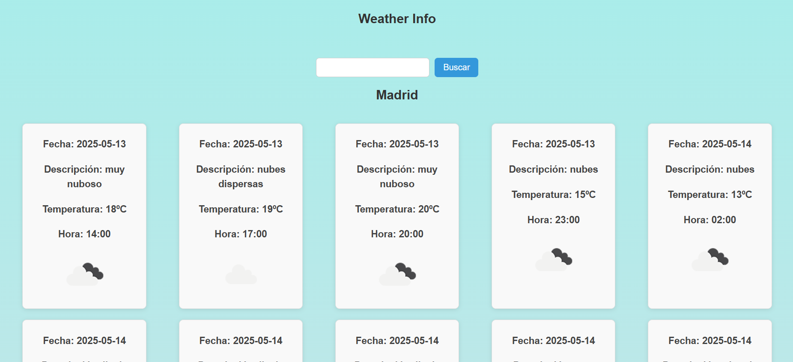

# 🌤 Weather Info App

Una aplicación web en React que muestra la información meteorológica de una ciudad. Al cargar, muestra el pronóstico para Madrid, pero puedes buscar cualquier otra ciudad usando el formulario.

---

## 🚀 Características

- Consulta el pronóstico extendido (cada 3 horas) usando la API de OpenWeather.
- Búsqueda de ciudad mediante un formulario.
- Renderizado de tarjetas con:
  - Hora
  - Temperatura
  - Descripción del clima
  - Icono del estado del tiempo
- Estilos centrados y diseño responsive básico.

---

## 🛠 Tecnologías utilizadas

- React
- CSS
- Vite
- OpenWeather API
- Fetch API

---

## 🌐 API utilizada

Usamos la [OpenWeather Forecast API](https://openweathermap.org/forecast5) para obtener los datos meteorológicos.

### Endpoint:

#### Haz fork + clone y luego

#### Instalar las dependencias
npm install

#### Ejecutar el servidor de desarrollo
npm run dev

#### Crear el archivo .env y agregar tu clave de API

## Vista previa de la aplicación en escritorio.

